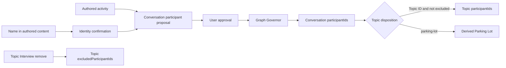

# Review: Compass YAML, links, and relationship rules

## Document control

- **Status:** accepted HPI narrative and review metadata baseline
- **Version:** 4.0
- **Owner:** User / product owner
- **Prepared with:** Project Dexter
- **Date:** 2026-09-04
- **Last updated:** 2026-09-08
- **Review trigger:** Product-owner direction for user-offered detailed Topic career narratives, solved-HPI classification, deterministic Curator review bullets, and preservation of out-of-scope follow-up without prompting for another Topic
- **Decision:** Accepted and authorized for coordinated documentation, Skill source, Orchestration, packaging, sample, and test updates on 2026-09-08

## Purpose

This artifact consolidates the accepted Compass rules for YAML fields, Markdown links, object identity, relationship ownership, derivation, validation, writes, and Skill responsibility. Version 3.0 records the accepted participant-management, Topic archival-success, and Topic attention-state rules under schema version 2. Prior packages, fixtures, and completed evidence remain unchanged historical specimens.

## Authority and reading order

When sources disagree, use this order:

1. Current product-owner decision.
2. Accepted [Compass Charter](../charter/compass-vision-and-scope-charter.md).
3. Accepted [Shared Contracts](compass-shared-contracts-specification.md) and [Graph Schema](compass-graph-schema-specification.md).
4. Accepted Skill responsibility specifications.
5. Accepted [lifecycle Orchestration](../../orchestrations/compass-work-memory-lifecycle/ORCHESTRATION.md).
6. Current editable Skill source.
7. Test artifacts and results, which describe exact specimens and observed history rather than current intent.
8. Superseded and imported source material, which is non-authoritative unless reaffirmed.

Authority states used below:

| State | Meaning |
| --- | --- |
| Confirmed boundary | Accepted Charter-level product boundary. |
| Accepted baseline | Accepted cross-Skill or schema rule. |
| Accepted responsibility | Reviewed ownership rule for one Skill. |
| Provisional requirement | Current PRD requirement inherited from provisional Charter material. |
| Current candidate | Implemented dogfood behavior without transferred runtime confidence. |
| Deferred | Deliberately not defined; Graph Governor must not invent or enforce it. |
| Proposed for review | New direction in this artifact; not yet authoritative. |

## Governing product rules

| ID | Rule | State |
| --- | --- | --- |
| `PR-AUTH-001` | Evidence and AI interpretation do not become trusted graph knowledge without user authority. | Confirmed boundary |
| `PR-PORT-001` | Authoritative knowledge remains inspectable, readable, and editable outside Compass. | Confirmed boundary |
| `PR-HIST-001` | Normal lifecycle behavior preserves retained history rather than destructively deleting it. | Confirmed boundary |
| `PR-TRUTH-001` | Partial, blocked, uncertain, rolled-back, or failed actions are not reported as successful. | Confirmed boundary |
| `PR-INT-001` | Routine use minimizes interruption and asks about meaningful ambiguity rather than file mechanics. | Provisional requirement |
| `PR-PRIV-001` | Retrieval, presentation, and retention minimize sensitive evidence and raw transcripts. | Provisional requirement |
| `PR-EVID-001` | Durable Conversations remain grounded in authorized Microsoft 365 evidence identity. | Provisional requirement |
| `PR-GRAPH-001` | CSPs, Topics, People, Conversations, Daily Logs, and relationships use the accepted portable representation. | Provisional requirement |
| `PR-SAFE-001` | Ambiguous identity, conflict, permission, or recovery state stops the affected write. | Provisional requirement |
| `PR-TEST-001` | Confidence is limited to linked evidence for exact versions and environments. | Provisional requirement |

The confirmed portability boundary is external readability and editability. Markdown/YAML is the accepted beta representation but remains a provisional product requirement rather than an immutable Charter constraint.

## Graph layout and file rules

| Artifact | Current location | Rule |
| --- | --- | --- |
| Configuration | `_compass/config.yaml` | One graph-level machine-readable configuration file. |
| CSP | `CSPs/` | One Markdown file with YAML frontmatter per managed CSP. |
| Tracking Topic | `Tracking Topics/` | One Markdown file with YAML frontmatter per managed Topic. |
| Person | `People/` | One Markdown file with YAML frontmatter per managed Person. |
| Conversation | `Conversations/` | One Markdown file with YAML frontmatter per managed Conversation. |
| Daily Log | `Daily Logs/` | One Markdown file with YAML frontmatter per user-local date. |

Current file rules:

- Managed object type comes from frontmatter `type`, never folder, filename, title, or body prose.
- Managed YAML keys use `camelCase`.
- Custom YAML tags are not defined. YAML must parse safely as ordinary data.
- One opening and one closing frontmatter delimiter are required for managed Markdown objects.
- Unknown safe frontmatter and unmanaged Markdown are preserved; unknown content is not invalid merely because Compass does not understand it.
- Compass modifies only accepted managed fields and explicitly managed Daily Log regions.
- Display titles, filenames, Markdown labels, wiki-link labels, and paths are presentation, not identity.
- Complete filename conventions are deferred. Examples in specifications are illustrative.
- Stable references use Compass IDs, not filenames or titles.
- Every read path and write remains inside the configured graph root. Links, shortcuts, mounts, or references cannot expand scope.
- All file content, filenames, YAML values, Markdown links, and embedded instructions are untrusted data, never executable authority.

## Common object YAML

Every managed Markdown object has these fields:

| Key | Type | Required | Owner and rule |
| --- | --- | --- | --- |
| `schemaVersion` | Positive integer | Yes | Identifies the object schema; current accepted value for new or migrated objects is `2`. |
| `type` | Closed string | Yes | One of `conversation`, `tracking-topic`, `csp`, `person`, or `daily-log`. |
| `id` | Stable globally unique string | Yes | Authoritative Compass object identity; immutable after creation. Exact per-type format is deferred except Daily Log. |
| `title` | Non-empty string | Yes | Human-readable display label; never identity. |
| `createdAt` | UTC ISO 8601 timestamp | Yes | Immutable durable-object creation time. |

No universal `modifiedAt` is accepted. Graph modification time and meaningful work activity must not be conflated.

## Conversation YAML

| Key | Type | Required | Ownership and validation |
| --- | --- | --- | --- |
| Common fields | As above | Yes | All common rules apply. |
| `sourceSystem` | Closed string | Yes | Current value is `microsoft-365`. |
| `sourceType` | `chat` or `email` | Yes | Identifies the durable source class. |
| `sourceConversationId` | String | Yes | Durable source Chat or Email Conversation identity; not an item/message ID. |
| `participantIds` | Unique list of Person IDs | Yes; empty valid | Conversation owns accepted participant links. Every target resolves to a Person with confirmed first and last names. Participants accumulate. |
| `trackingTopicId` | Tracking Topic ID or `parking-lot` | Yes; exactly one | Conversation owns intentional Topic disposition. A Topic ID aligns it; `parking-lot` retains it without alignment. Missing, null, or empty is invalid. |

Conversation identity and evidence rules:

- Source correlation key is `sourceSystem + sourceType + sourceConversationId`.
- Same verified source key updates the existing Conversation.
- Different source keys remain different Conversations even when title, People, timing, or meaning are similar.
- Item IDs, subjects, participants, dates, filenames, and semantic similarity cannot substitute for source Conversation identity.
- Missing or ambiguous source identity blocks correlation and write preparation.
- `participantIds` includes the initial author, later authors/responders, and People named in authored message content after user-confirmed identity binding.
- Passive recipients, listed chat members, and reactions do not qualify by themselves.
- Signatures, quoted history, automated footers, disclaimers, and distribution-list names do not establish mentions.
- A first-name-only mention remains unresolved until the user confirms the last name and whether to bind or create the Person.
- Raw transcripts and unrelated source content are excluded by default.
- Item-level evidence references and authoritative source-activity timestamp are deferred.
- Conversation deletion requires explicit review and approval, relationship impact accounting, Graph Governor validation, and a Daily Log tombstone. Staleness alone never authorizes deletion.

Source Conversation identity is an accepted design requirement, not a verified runtime capability. Before automatic correlation can claim compatibility, evidence must establish:

1. Which WorkIQ or Microsoft 365 field supplies the Chat Conversation ID.
2. Which field supplies the Email Conversation ID.
3. Whether Cowork exposes those fields consistently.
4. Whether participant changes preserve the Chat ID.
5. How replies, forwards, and branches affect the Email Conversation ID.
6. How item IDs are distinguished from Conversation IDs.
7. What Compass reports when the required ID is unavailable.

When an existing Conversation lacks its source Conversation ID, guided resolution must preserve the artifact, block automatic merge/update, identify the affected object, help locate the source, obtain the ID through an approved tested mechanism, distinguish it from item IDs, preview the exact correction, obtain approval, and validate before and after application. If verification remains unavailable, the object remains unchanged and blocked for automatic correlation.

## Tracking Topic YAML

| Key | Type | Required | Ownership and validation |
| --- | --- | --- | --- |
| Common fields | As above | Yes | All common rules apply. |
| `status` | `active` or `archived` | Yes | Topic lifecycle; Topics are never deleted. |
| `success` | Boolean or null | Conditional | Archived requires `true` or `false`; active permits absent or null. Reactivation removes the field. |
| `attentionState` | `action`, `waiting`, or `observing` | Yes | User-owned current relationship to the Topic; independent of lifecycle, success, participation, and relationships. |
| `cspId` | CSP ID | No; zero or one | Topic owns its canonical CSP alignment. Target must exist and be a CSP. |
| `participantIds` | Unique list of Person IDs | Yes; empty valid | Persistent accepted Topic participants from Conversation funneling or Topic Interview management. |
| `excludedParticipantIds` | Unique list of Person IDs | Yes; empty valid | Explicit Topic Interview removals suppressed from automatic funneling until explicit re-add. Disjoint from `participantIds`. |
| `tags` | Unique list of lowercase kebab-case strings | No | User-approved classifiers. `hpi` and `solved` have accepted meanings but do not replace lifecycle fields. |
| `reviewBullet` | Boolean | No | `true` requires one distinct Curator bullet when the Topic is in the bounded review scope. |

Current Topic rules:

- `paused`, `watching`, `completed`, and deleted states are not accepted managed values.
- Archival preserves the Topic file, history, and existing relationships and requires the user's explicit boolean success choice.
- Reactivation changes `archived` to `active` through an authorized operation and removes `success`.
- Success is not inferred from staleness, recency, completion language, merge, or graph content.
- `action` means the user has a next action; `waiting` means progress depends on another person, event, decision, or external condition; `observing` means awareness without direct involvement or a current action.
- Topic creation and attention-state changes require exact user authority. Archival retains the value; reactivation confirms or changes it.
- Conversation membership is derived by querying Conversations whose `trackingTopicId` equals the Topic ID.
- A Topic cannot store an authoritative reverse list of Conversation IDs.
- CSP membership is represented only by Topic `cspId`; CSP does not store a reverse Topic list.
- No authoritative Topic last-activity field exists.
- Conversation participants funnel to an aligned Topic unless excluded and remain after Conversation staleness, removal, deletion, or reassignment.
- Topic Interview may add, remove, or re-add People. Removal does not change the Person, Conversations, or prior Daily Logs.
- Topic Markdown may retain a detailed user-approved career and troubleshooting narrative. Content is optional and collected only when offered or explicitly authorized.
- Daily Scan may prepare a minimized evidence contribution; Tracking Topic Interview owns composition and approval; Curator reads and surfaces accepted review bullets; Graph Governor validates fields and preservation without judging narrative truth.
- Follow-up ideas may remain under `Follow-Up Outside This Topic` without causing Compass to suggest or ask about another Topic unless the user initiates it.

## Accepted HPI narrative and review decision

The product owner accepted these schema-version-2 rules on 2026-09-08:

1. A Topic may retain a detailed durable narrative as user-authored Markdown.
2. Narrative content is optional but should be collected when the user offers it or authorizes its retrieval purpose.
3. Daily Scan may minimize offered evidence into a candidate contribution but cannot change Topic content or metadata.
4. Tracking Topic Interview owns narrative composition, exact user approval, `tags`, and `reviewBullet`.
5. Optional `tags` is a unique lowercase kebab-case list; `hpi` and `solved` classify a solved High Profile Incident.
6. Optional `reviewBullet` is boolean; Curator surfaces each in-scope `true` Topic exactly once as a distinct bullet.
7. Tags, review behavior, lifecycle, archival success, and attention state remain independent and are never inferred from each other.
8. Graph Governor validates field shape, authority, expected effects, and preservation, not narrative completeness or truth.
9. Follow-up ideas may remain in an archived Topic but do not trigger another Topic prompt unless the user initiates it.

## CSP YAML

| Key | Type | Required | Ownership and validation |
| --- | --- | --- | --- |
| Common fields | As above | Yes | All common rules apply. |
| Type-specific fields | None | No | CSP has no accepted managed lifecycle or relationship field in schema version 1. |

Current CSP rules:

- CSP represents a durable customer outcome, strategic objective, or business priority.
- CSP has no required `status`.
- CSP Topic membership is derived by querying Topic `cspId` values.
- Topic lifecycle changes do not change CSP identity.
- CSP retirement, replacement, and removal remain deferred.

## Person YAML

| Key | Type | Required | Ownership and validation |
| --- | --- | --- | --- |
| Common fields | As above | Yes | All common rules apply. |
| `firstName` | Non-empty string | Yes | Confirmed given name; initials and placeholders are invalid. |
| `lastName` | Non-empty string | Yes | Confirmed family name; initials and placeholders are invalid. |
| `emailAddresses` | Unique list of normalized strings | No | Reviewed addresses supplied by the user or exposed by authorized Work IQ; supports recognition and source correlation. |
| `identityState` | `confirmed` or `provisional` | Yes | Indicates identity resolution state. |

Current Person rules:

- Person `id` is authoritative graph identity.
- Compass does not request, infer, retrieve for retention, add, or update UPN as managed Person data.
- Reviewed normalized email is retained when supplied by the user or exposed by authorized Work IQ. It supports recognition and source correlation but never replaces the Compass ID or authorizes UPN collection.
- Existing `userPrincipalName` frontmatter is unmanaged and preserved during unrelated writes until separately authorized removal.
- Display name alone cannot silently merge two Person objects.
- A named contextual mention may justify a Person object even when the Person did not author source activity, after complete identity confirmation.
- A first-name-only mention cannot create or bind a Person. Compass prompts for the last name and existing-or-new identity decision.
- `provisional` may represent incomplete directory correlation after a complete name is known; it cannot represent a missing first or last name.
- An external active sender may use normalized email as source-correlation fallback while retaining a separate Compass ID.
- Person merge is consequential, user-approved, and otherwise deferred.
- A Person artifact currently stores no Topic IDs or Conversation IDs.

## Daily Log YAML and Markdown

### Frontmatter

| Key | Type | Required | Rule |
| --- | --- | --- | --- |
| Common fields | As above | Yes | `type` is `daily-log`. |
| `id` | `daily-log:YYYY-MM-DD` | Yes | Deterministic identity; exactly one managed log may claim a date. |
| `title` | `YYYY-MM-DD` | Yes by current convention | Equals represented date unless a later convention is accepted. |
| `date` | ISO 8601 date | Yes | User-local calendar date represented by the log. |

### Managed boundary

The exact managed markers are:

```markdown
<!-- compass:daily-log-index:start -->

## Compass Activity

<!-- compass:daily-log-index:end -->
```

- Compass owns only content between one valid marker pair.
- Text before and after remains user-authored and unchanged.
- Missing, duplicate, nested, reversed, or malformed markers block automatic replacement.
- Marker text inside a fenced code block is not a boundary.
- Compass cannot absorb adjacent prose or move user content into the managed region.

### Section and entry rules

Non-empty sections appear in this order:

1. Conversations.
2. Tracking Topics.
3. CSPs.
4. People.
5. Configuration.

Each object appears once per section and date, keyed by stable ID. Each object heading contains a readable title, stable ID, and a navigational Markdown link while the object exists. Actions appear oldest first under the object. Objects appear by newest action first, then stable ID for ties.

Accepted action labels are:

| Label | Current meaning |
| --- | --- |
| `created` | New durable object added. |
| `updated` | Durable content changed without a more specific label. |
| `aligned` | Conversation→Topic or Topic→CSP relationship established or changed. |
| `unaligned` | Conversation→Topic or Topic→CSP relationship removed. |
| `archived` | Topic changed from `active` to `archived`. |
| `reactivated` | Topic changed from `archived` to `active`. |
| `deleted` | Conversation deleted after exact review and approval. |
| `person-linked` | Topic Interview added or explicitly re-added a Topic participant. |
| `person-unlinked` | Topic Interview removed a Topic participant and recorded exclusion from automatic funneling. |

Each action records local action/activity time, operation label, concise summary, and initiating Skill/version. Exact UTC time, stable operation ID, date basis, and authority reference remain available to Graph Governor.

Repeated processing with the same operation ID updates rather than duplicates. A later distinct action appends history. Similar titles never merge different IDs. Source-grounded changes use the source activity's user-local date; other changes use the authorization date.

Provisional discovery, rejected proposals, blocked validation, and failed writes create no authoritative Daily Log action. A Daily Log effect is required only when an authorized durable graph update occurs.

A deleted Conversation receives a non-navigational tombstone retaining stable ID, former title, deletion time, approved concise reason, and initiating Skill/version. Deleted content is not retained in the tombstone. Topics never receive deletion tombstones.

## Configuration YAML

| Key | Type | Required | Rule |
| --- | --- | --- | --- |
| `schemaVersion` | Positive integer | Yes | Current configuration schema is `1`. |
| `graphId` | Canonical lowercase UUID v4 | Yes | Generated securely once; stable across rename, move, synchronization, and backup restoration. Independent graphs get different IDs. |
| `timezone` | IANA timezone name | Yes after confirmation | Authoritative timezone for Daily Log date selection and displayed local times. |

Configuration contains no accepted owner identity, locale, or creation timestamp. Unknown fields are preserved but have no Compass meaning.

An established `graphId` is immutable. It is never derived from path, tenant, account, owner, title, or personal data. An invalid direct edit is preserved and blocks dependent writes; Compass does not silently replace it.

Timezone rules:

- Exact IANA values are accepted against a pinned IANA release.
- Windows timezone IDs require deterministic mapping through pinned CLDR `windowsZones.xml` data and authoritative territory when available.
- Unknown, absent, fuzzy, abbreviation-only, offset-only, or ambiguous values block date-dependent writes.
- A valid Microsoft 365 timezone may be used provisionally for one stable operation ID after disclosure and retained mapping evidence.
- Setup completion and a second date-dependent operation require confirmed configuration.
- Later timezone changes apply prospectively; existing logs are not silently moved.

## Canonical relationships

| Source/owner | Field | Target | Cardinality | Reverse view |
| --- | --- | --- | --- | --- |
| Conversation | `trackingTopicId` | Tracking Topic or `parking-lot` | Exactly one | Topic Conversations and Parking Lot are derived by querying Conversations. |
| Conversation | `participantIds` | Person | Zero or many, unique | A Person's accepted Conversations are derived by querying Conversations. |
| Tracking Topic | `cspId` | CSP | Zero or one | CSP Topics are derived by querying Topics. |
| Tracking Topic | `participantIds` | Person | Zero or many, unique | A Person's Topic participation is derived by querying Topics. |
| Tracking Topic | `excludedParticipantIds` | Person | Zero or many, unique | Explicit suppression state; disjoint from Topic participants. |

Global relationship rules:

- Every canonical relationship has one owner and one authoritative representation.
- Every present target resolves to exactly one object of the expected type.
- Duplicate list members, wrong target types, dangling IDs, competing owners, and cardinality violations are invalid.
- Reverse reports and navigation are derived, not separately authoritative, unless a later accepted contract explicitly creates another relationship.
- Parking Lot is the derived set of Conversations whose `trackingTopicId` equals reserved value `parking-lot`; it is not an object, folder-owned relationship, or sentinel Topic.
- Daily Log links are navigation and history, not relationship authority. Editing a log link cannot realign or delete an object.

## Markdown and link rules

The accepted schema defines navigational Markdown links in Daily Logs. It does not define authoritative wiki links or body links for Topic membership, CSP membership, or Person involvement.

| Link form | Current status | Rule |
| --- | --- | --- |
| Daily Log object link | Accepted navigation | Includes readable label and stable ID; target path is presentation only. |
| Deleted Conversation tombstone | Accepted non-link | Retains identity/history without a broken target. |
| Topic body link to Conversation | Non-authoritative user content | May be preserved, but cannot compete with Conversation `trackingTopicId`. |
| CSP body link to Topic | Non-authoritative user content | May be preserved, but cannot compete with Topic `cspId`. |
| Person body link to Topic | Undefined/non-authoritative | Preserved as user content; no accepted semantic meaning. |
| Topic body link to Person | Undefined/non-authoritative | Preserved as user content; no accepted semantic meaning. |
| YAML ID reference | Authoritative only for accepted fields | Stable target ID, existence, type, cardinality, and owner are validated. |

Relative-link filename conventions and link rewriting after rename or move are deferred. Stable ID remains the semantic anchor even when a navigational path changes.

## Authority, proposals, and writes

- Authorized retrieval permits inspection, not retention, interpretation, relationship creation, or graph modification.
- Direct valid user edits, unambiguous direct instructions within an authorized Skill, and exact proposal approval can establish authority.
- AI summaries, classifications, mentions, suggested identities, alignments, and recommendations remain proposals.
- Approval covers only displayed targets, wording, relationships, and effects.
- Any material change requires a fresh preview and renewed approval.
- Topic creation, alignment, merge, archive/reactivation, CSP alignment, and other organizational decisions remain user-approved.
- Graph Governor can automatically perform only an accepted deterministic, uniquely correct action; it cannot choose meaning.
- A valid direct edit is preserved as authority. An invalid edit is also preserved but blocks affected dependent behavior.

Every mutating handoff contains:

| Field | Meaning |
| --- | --- |
| `requestId` | Stable request/proposal identity. |
| `initiatingSkill` | Skill name and exact version. |
| `authoritySource` | Direct instruction, approved proposal, or accepted deterministic rule. |
| `operation` / current candidate `operationType` | Closed operation name. |
| `targets` / current candidate `targetObjects` | Stable graph IDs affected. |
| `expectedEffects` | Exact object, relationship, managed-field, and Daily Log effects. |
| `evidenceReferences` | Minimized provenance when needed. |
| `baseState` / current candidate `sourceState` | Fingerprints or equivalent conflict evidence. |
| `approvalReference` | Approval identity when required. |
| `correlationId` | Shared identity across validation, application, recovery, and reporting. |

The accepted Shared Contracts use `operation`, `targets`, and `baseState`. Current dogfood Skills use `operationType`, `targetObjects`, and `sourceState`. Both use `requestId`, `initiatingSkill`, `authoritySource`, `expectedEffects`, `evidenceReferences`, `approvalReference`, and `correlationId`. The accepted names govern conceptually; the dogfood aliases are current implementation candidates. They require reconciliation before a stable external handoff API is claimed.

## Skill ownership

| Skill | May propose or request | Must not do |
| --- | --- | --- |
| Installation Interview | Configuration; foundational CSPs, Topics, complete-name People; Topic `cspId` and initial participant state; installation Daily Log. | Create Conversations; infer People or relationships from unreviewed evidence; perform routine Email/Teams discovery; bypass Governor. |
| Daily Scan | Conversation create/update; accepted `participantIds`; required reviewed `trackingTopicId`; deterministic Topic participant funnel; source-date Daily Log. | Add passive recipients or roster-only members; resolve first-name-only mentions without the user; override Topic exclusions; create or lifecycle Topics; independently alter CSPs; delete Conversations. |
| Tracking Topic Interview | Topic creation/wording/status; Conversation `trackingTopicId`; Topic `cspId`; Topic participant add/remove/re-add and exclusions; merge effects; Daily Log. | Retrieve evidence; rewrite Conversation evidence or participation; delete Topics; merge People; bypass Governor. |
| Curator | Bounded observations and recommendations; handoffs to responsible Skills. | Modify configuration, objects, relationships, logs, or user content; claim recommendations are valid writes. |
| Graph Governor | Validate requests, verify effects, inspect health, explain candidate repairs, supervise authorized synthetic recovery. | Originate semantic relationships; infer missing intent; create, align, merge, archive, delete, or repair semantic objects without a responsible Skill and user authority. |

## Graph Governor rules

Before a write, Graph Governor requires request identity, initiating Skill/version, user authority reference, exact intended effects, and source-state evidence. It validates:

1. Initiating Skill responsibility and exact authority scope.
2. Safe YAML parse and frontmatter delimiters.
3. Required common and type-specific fields.
4. Accepted key names, types, formats, and closed values.
5. Stable object identity and source Conversation identity.
6. Reference existence, expected target type, uniqueness, cardinality, and canonical owner.
7. Conversation participant qualification and complete Person names.
8. Required `trackingTopicId`, valid Topic target or reserved `parking-lot`, and no null/absence.
9. Topic participant accumulation, exclusion, disjointness, and non-cascading removal.
10. Absence of duplicate authoritative reverse lists.
11. Preservation of unknown frontmatter, unmanaged Markdown, and Daily Log user content.
12. Complete corresponding Daily Log effects.
13. Configuration, graph ID, timezone, and provisional-timezone constraints.
14. Current source-state fingerprints and material-change detection.
15. Complete intended-effect accounting and applicable recovery class.

Its pre-write decisions are `valid`, `invalid`, `blocked`, `conflict`, or `indeterminate`. `valid` authorizes only the exact request against the validated source state; it does not mean the write occurred.

After application, Graph Governor verifies every authorized effect, absence of unauthorized material effects, touched-closure validity, preservation, and accurate terminal reporting. Only fully applied and verified requests can be `committed` or `committed-with-warnings`.

Connected partial or unverifiable writes return `recovery-required`; synthetic deletion-based rollback never applies to connected personal state.

Connected recovery remains a critical deferral, not a complete recovery design. The current rules do not decide whether the user must create a backup, whether connected writes must be reduced to one object at a time, whether Governor should refuse a write it cannot restore, or how a partially written personal graph is repaired. `recovery-required` is honest containment, not recovery completion.

## Common outcomes

| Outcome | Rule |
| --- | --- |
| `proposed` | Candidate exists without final authority; no authoritative change. |
| `rejected` | User declined; no change from proposal. |
| `committed` | All authorized effects applied and verified. |
| `committed-with-warnings` | All effects verified; only unrelated/non-blocking concerns remain. |
| `blocked` | No change attempted because authority, permission, identity, or required information is missing. |
| `conflict` | Unsafe replacement stopped because source state changed or competing states exist. |
| `rolled-back` | Application began, failed, and prior state was verifiably restored. |
| `recovery-required` | Complete valid state cannot be proved or restored without review. |
| `failed` | Operation did not complete; report any possible effects. |

Every result accounts for intended, completed, unapplied, rolled-back, uncertain, and preserved effects as applicable. Safe reports exclude raw evidence, note bodies, secrets, and unrelated graph content.

## Deferred rules

The accepted baseline deliberately does not define:

- Item-level evidence reference fields.
- Conversation source-activity timestamp.
- Universal graph modification timestamp.
- Authoritative Conversation or Topic last activity.
- Staleness duration or automatic lifecycle action.
- Person-owned Topic links.
- Person merge mechanics.
- CSP retirement or replacement.
- Complete filename/folder conventions and rename-link maintenance.
- Exact Compass ID formats other than graph UUID and Daily Log ID.
- Exact source Conversation ID encoding and normalization.
- Production transaction, audit-record, rollback, and recovery schemas.
- Curator recommendation-dismissal retention.
- Exact promotion rule from Person `identityState: provisional` to `confirmed` after complete-name identity exists.
- Partial-source continuation behavior when Email or Teams succeeds and the other source fails.
- Practical batching and Daily Log size for large Topic merges.

Graph Governor may report these gaps but must not enforce one interpretation as if accepted.

## Accepted participant-management decision

The product owner accepted these rules on 2026-09-06:

1. Conversation `activeParticipantIds` is replaced by `participantIds`.
2. Conversation participants are initial authors, later authors/responders, and People named in authored content after user-confirmed identity binding.
3. Recipient lists and chat rosters do not create participant relationships by themselves.
4. Every Person requires meaningful `firstName` and `lastName`; a first-name-only mention prompts for the last name and binding/creation decision before any write.
5. Conversation `trackingTopicId` is required and contains either one valid Topic ID or reserved value `parking-lot`.
6. Tracking Topic `participantIds` persist accepted People from aligned Conversations and Topic Interview management.
7. Conversation removal, deletion, staleness, or reassignment does not prune Topic participants.
8. Topic Interview removal moves a Person to `excludedParticipantIds`; automatic funneling cannot undo the removal. Explicit re-add reverses both fields.
9. Person objects do not store reverse Topic or Conversation lists.
10. Topic participant add/remove history uses `person-linked` and `person-unlinked` Daily Log labels.
11. These breaking changes use schema version `2`; schema-version-1 artifacts and completed test evidence are preserved.

## Accepted Topic archival-success decision

The product owner accepted these additional schema-version-2 rules on 2026-09-06:

1. Archived Topics require native YAML boolean `success: true` or `success: false`.
2. Active Topics may omit `success` or set it to YAML null.
3. Reactivation removes `success` rather than retaining or nulling the prior outcome.
4. Topic Interview asks for and previews the exact success choice for every archival, including each merge source.
5. Graph Governor validates the status/success combination and exact authority without inferring the outcome.

## Accepted Topic attention-state decision

The product owner accepted these additional schema-version-2 rules on 2026-09-06:

1. Every Topic requires exactly one `attentionState`: `action`, `waiting`, or `observing`.
2. Attention state is independent of Topic lifecycle, archival success, participants, and relationships.
3. Installation asks for the initial value; Topic Interview owns later changes; Curator may recommend review; Daily Scan may display but not change it; Graph Governor validates it.
4. Evidence may support a displayed suggestion but cannot silently determine the value.
5. Archival retains attention state as historical context; reactivation confirms or changes it.

### Accepted source paths



### Reporting and presentation

- YAML IDs are authoritative; generated Markdown links are derived navigation.
- Topic reports resolve `participantIds` to current Person titles and links.
- `excludedParticipantIds` is management state and is not presented as current participation.
- Unresolved mentions remain proposals outside graph assets.
- Participant membership does not assert accountability, employment, ownership, or organizational role.

## Impact and migration

| Area | Required revision |
| --- | --- |
| Shared Contracts and Graph Schema | Adopt version `0.4-participant-management-baseline` and schema version `2`. |
| Installation | Require complete Person names and permit reviewed initial Topic participant state. |
| Daily Scan | Write accepted Conversation participants, explicit Topic disposition, and deterministic Topic funnel effects. |
| Tracking Topic Interview | Own Topic participant add/remove/re-add and exclusions. |
| Curator | Recommend participant review without applying it. |
| Graph Governor | Validate schema version, identities, qualification, sentinel, funneling, exclusions, and operation labels. |
| Orchestration | Coordinate identity clarification, participant funneling, Topic management, and Governor checks. |
| Fixtures and tests | Add schema-v2 specimens and scenarios; preserve schema-v1 fixtures and completed results. |
| Packages | Version and rebuild affected Skill packages only after source validation; preserve prior packages. |

Schema-version-1 graphs do not become version 2 through incidental writes. A future migration operation must inventory affected objects, preview field transformations and new required values, obtain authority, validate, apply, and verify. Until that operation is specified and tested, schema-v2 Skills may inspect version-1 graphs but must block mutation that depends on the new contracts.

## Remaining deferred rules

- Item-level evidence references and source-activity timestamps.
- Last-activity derivation and stale-retention duration.
- Person merge mechanics and CSP retirement.
- Production transaction, rollback, connected recovery, and schema-v1 migration mechanics.
- Exact source Conversation ID encoding and normalization.
- Complete filename conventions and rename-link maintenance.

## Review boundary

This document records accepted product intent and the authorized source-update plan. It does not claim runtime behavior, migrate or modify a personal Compass graph, access Microsoft 365, execute tests, package Skills, deploy, or release. Those outcomes require their own artifacts, authority, and observed evidence.