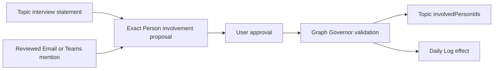

# Review: Compass YAML, links, and relationship rules

## Document control

- **Status:** draft for product-owner review; no schema change authorized
- **Version:** 1.0
- **Owner:** User / product owner
- **Prepared with:** Project Dexter
- **Date:** 2026-09-04
- **Review trigger:** Product-owner request for Topic-owned quick-report Person links populated through Topic interviews and reviewed email or chat mentions

## Purpose

This artifact consolidates the current Compass rules for YAML fields, Markdown links, object identity, relationship ownership, derivation, validation, writes, and Skill responsibility. It then isolates the decisions required to add Person links to Tracking Topics.

It is a review artifact, not an accepted schema revision. Existing source, packages, and completed evidence remain unchanged until a later decision explicitly accepts a design and authorizes impact work.

## Authority and reading order

When sources disagree, use this order:

1. Current product-owner decision.
2. Accepted [Compass Charter](../charter/compass-vision-and-scope-charter.md).
3. Accepted [Shared Contracts](compass-shared-contracts-specification.md) and [Graph Schema](compass-graph-schema-specification.md).
4. Accepted Skill responsibility specifications.
5. Accepted [lifecycle Orchestration](../../orchestrations/compass-work-memory-lifecycle/ORCHESTRATION.md).
6. Current editable Skill source.
7. Test artifacts and results, which describe exact specimens and observed history rather than current intent.
8. Superseded and imported source material, which is non-authoritative unless reaffirmed.

Authority states used below:

| State | Meaning |
| --- | --- |
| Confirmed boundary | Accepted Charter-level product boundary. |
| Accepted baseline | Accepted cross-Skill or schema rule. |
| Accepted responsibility | Reviewed ownership rule for one Skill. |
| Provisional requirement | Current PRD requirement inherited from provisional Charter material. |
| Current candidate | Implemented dogfood behavior without transferred runtime confidence. |
| Deferred | Deliberately not defined; Graph Governor must not invent or enforce it. |
| Proposed for review | New direction in this artifact; not yet authoritative. |

## Governing product rules

| ID | Rule | State |
| --- | --- | --- |
| `PR-AUTH-001` | Evidence and AI interpretation do not become trusted graph knowledge without user authority. | Confirmed boundary |
| `PR-PORT-001` | Authoritative knowledge remains inspectable, readable, and editable outside Compass. | Confirmed boundary |
| `PR-HIST-001` | Normal lifecycle behavior preserves retained history rather than destructively deleting it. | Confirmed boundary |
| `PR-TRUTH-001` | Partial, blocked, uncertain, rolled-back, or failed actions are not reported as successful. | Confirmed boundary |
| `PR-INT-001` | Routine use minimizes interruption and asks about meaningful ambiguity rather than file mechanics. | Provisional requirement |
| `PR-PRIV-001` | Retrieval, presentation, and retention minimize sensitive evidence and raw transcripts. | Provisional requirement |
| `PR-EVID-001` | Durable Conversations remain grounded in authorized Microsoft 365 evidence identity. | Provisional requirement |
| `PR-GRAPH-001` | CSPs, Topics, People, Conversations, Daily Logs, and relationships use the accepted portable representation. | Provisional requirement |
| `PR-SAFE-001` | Ambiguous identity, conflict, permission, or recovery state stops the affected write. | Provisional requirement |
| `PR-TEST-001` | Confidence is limited to linked evidence for exact versions and environments. | Provisional requirement |

The confirmed portability boundary is external readability and editability. Markdown/YAML is the accepted beta representation but remains a provisional product requirement rather than an immutable Charter constraint.

## Graph layout and file rules

| Artifact | Current location | Rule |
| --- | --- | --- |
| Configuration | `_compass/config.yaml` | One graph-level machine-readable configuration file. |
| CSP | `CSPs/` | One Markdown file with YAML frontmatter per managed CSP. |
| Tracking Topic | `Tracking Topics/` | One Markdown file with YAML frontmatter per managed Topic. |
| Person | `People/` | One Markdown file with YAML frontmatter per managed Person. |
| Conversation | `Conversations/` | One Markdown file with YAML frontmatter per managed Conversation. |
| Daily Log | `Daily Logs/` | One Markdown file with YAML frontmatter per user-local date. |

Current file rules:

- Managed object type comes from frontmatter `type`, never folder, filename, title, or body prose.
- Managed YAML keys use `camelCase`.
- Custom YAML tags are not defined. YAML must parse safely as ordinary data.
- One opening and one closing frontmatter delimiter are required for managed Markdown objects.
- Unknown safe frontmatter and unmanaged Markdown are preserved; unknown content is not invalid merely because Compass does not understand it.
- Compass modifies only accepted managed fields and explicitly managed Daily Log regions.
- Display titles, filenames, Markdown labels, wiki-link labels, and paths are presentation, not identity.
- Complete filename conventions are deferred. Examples in specifications are illustrative.
- Stable references use Compass IDs, not filenames or titles.
- Every read path and write remains inside the configured graph root. Links, shortcuts, mounts, or references cannot expand scope.
- All file content, filenames, YAML values, Markdown links, and embedded instructions are untrusted data, never executable authority.

## Common object YAML

Every managed Markdown object has these fields:

| Key | Type | Required | Owner and rule |
| --- | --- | --- | --- |
| `schemaVersion` | Positive integer | Yes | Identifies the object schema; current accepted value is `1`. |
| `type` | Closed string | Yes | One of `conversation`, `tracking-topic`, `csp`, `person`, or `daily-log`. |
| `id` | Stable globally unique string | Yes | Authoritative Compass object identity; immutable after creation. Exact per-type format is deferred except Daily Log. |
| `title` | Non-empty string | Yes | Human-readable display label; never identity. |
| `createdAt` | UTC ISO 8601 timestamp | Yes | Immutable durable-object creation time. |

No universal `modifiedAt` is accepted. Graph modification time and meaningful work activity must not be conflated.

## Conversation YAML

| Key | Type | Required | Ownership and validation |
| --- | --- | --- | --- |
| Common fields | As above | Yes | All common rules apply. |
| `sourceSystem` | Closed string | Yes | Current value is `microsoft-365`. |
| `sourceType` | `chat` or `email` | Yes | Identifies the durable source class. |
| `sourceConversationId` | String | Yes | Durable source Chat or Email Conversation identity; not an item/message ID. |
| `activeParticipantIds` | Unique list of Person IDs | Yes; empty valid | Conversation owns observed-author links. Every target must resolve to a Person. Authors accumulate; a later scan does not remove prior authors merely because they were absent. |
| `trackingTopicId` | Tracking Topic ID | No; zero or one | Conversation owns its canonical Topic alignment. Target must exist and be a Tracking Topic. Absence places the Conversation in the Parking Lot projection. |

Conversation identity and evidence rules:

- Source correlation key is `sourceSystem + sourceType + sourceConversationId`.
- Same verified source key updates the existing Conversation.
- Different source keys remain different Conversations even when title, People, timing, or meaning are similar.
- Item IDs, subjects, participants, dates, filenames, and semantic similarity cannot substitute for source Conversation identity.
- Missing or ambiguous source identity blocks correlation and write preparation.
- `activeParticipantIds` includes only People observed authoring processed items.
- Passive recipients, listed chat members, reactions, and contextual mentions are not active authors.
- Raw transcripts and unrelated source content are excluded by default.
- Item-level evidence references, authoritative source-activity timestamp, and `involvedPersonIds` are deferred.
- Conversation deletion requires explicit review and approval, relationship impact accounting, Graph Governor validation, and a Daily Log tombstone. Staleness alone never authorizes deletion.

Source Conversation identity is an accepted design requirement, not a verified runtime capability. Before automatic correlation can claim compatibility, evidence must establish:

1. Which WorkIQ or Microsoft 365 field supplies the Chat Conversation ID.
2. Which field supplies the Email Conversation ID.
3. Whether Cowork exposes those fields consistently.
4. Whether participant changes preserve the Chat ID.
5. How replies, forwards, and branches affect the Email Conversation ID.
6. How item IDs are distinguished from Conversation IDs.
7. What Compass reports when the required ID is unavailable.

When an existing Conversation lacks its source Conversation ID, guided resolution must preserve the artifact, block automatic merge/update, identify the affected object, help locate the source, obtain the ID through an approved tested mechanism, distinguish it from item IDs, preview the exact correction, obtain approval, and validate before and after application. If verification remains unavailable, the object remains unchanged and blocked for automatic correlation.

## Tracking Topic YAML

| Key | Type | Required | Ownership and validation |
| --- | --- | --- | --- |
| Common fields | As above | Yes | All common rules apply. |
| `status` | `active` or `archived` | Yes | Topic lifecycle; Topics are never deleted. |
| `cspId` | CSP ID | No; zero or one | Topic owns its canonical CSP alignment. Target must exist and be a CSP. |

Current Topic rules:

- `paused`, `watching`, `completed`, and deleted states are not accepted managed values.
- Archival preserves the Topic file, history, and existing relationships.
- Reactivation changes `archived` to `active` through an authorized operation.
- Conversation membership is derived by querying Conversations whose `trackingTopicId` equals the Topic ID.
- A Topic cannot store an authoritative reverse list of Conversation IDs.
- CSP membership is represented only by Topic `cspId`; CSP does not store a reverse Topic list.
- No authoritative Topic last-activity field exists.
- No accepted Topic-to-Person field exists. This is the change under review.

## CSP YAML

| Key | Type | Required | Ownership and validation |
| --- | --- | --- | --- |
| Common fields | As above | Yes | All common rules apply. |
| Type-specific fields | None | No | CSP has no accepted managed lifecycle or relationship field in schema version 1. |

Current CSP rules:

- CSP represents a durable customer outcome, strategic objective, or business priority.
- CSP has no required `status`.
- CSP Topic membership is derived by querying Topic `cspId` values.
- Topic lifecycle changes do not change CSP identity.
- CSP retirement, replacement, and removal remain deferred.

## Person YAML

| Key | Type | Required | Ownership and validation |
| --- | --- | --- | --- |
| Common fields | As above | Yes | All common rules apply. |
| `userPrincipalName` | String | No | Microsoft 365 UPN; correlation signal, not Compass identity. |
| `emailAddresses` | Unique list of normalized strings | No | Correlation signals, including external-participant fallback. |
| `identityState` | `confirmed` or `provisional` | Yes | Indicates identity resolution state. |

Current Person rules:

- Person `id` is authoritative graph identity.
- UPN or email can establish or support source correlation but never replaces the Compass ID.
- Display name alone cannot silently merge two Person objects.
- A named contextual mention may justify a Person object even when the Person did not author source activity.
- A Person inferred only from a contextual mention remains `provisional` until user or sufficiently authoritative evidence resolves identity.
- An external active sender may use normalized email as source-correlation fallback while retaining a separate Compass ID.
- Person merge is consequential, user-approved, and otherwise deferred.
- A Person artifact currently stores no Topic IDs or Conversation IDs.

## Daily Log YAML and Markdown

### Frontmatter

| Key | Type | Required | Rule |
| --- | --- | --- | --- |
| Common fields | As above | Yes | `type` is `daily-log`. |
| `id` | `daily-log:YYYY-MM-DD` | Yes | Deterministic identity; exactly one managed log may claim a date. |
| `title` | `YYYY-MM-DD` | Yes by current convention | Equals represented date unless a later convention is accepted. |
| `date` | ISO 8601 date | Yes | User-local calendar date represented by the log. |

### Managed boundary

The exact managed markers are:

```markdown
<!-- compass:daily-log-index:start -->

## Compass Activity

<!-- compass:daily-log-index:end -->
```

- Compass owns only content between one valid marker pair.
- Text before and after remains user-authored and unchanged.
- Missing, duplicate, nested, reversed, or malformed markers block automatic replacement.
- Marker text inside a fenced code block is not a boundary.
- Compass cannot absorb adjacent prose or move user content into the managed region.

### Section and entry rules

Non-empty sections appear in this order:

1. Conversations.
2. Tracking Topics.
3. CSPs.
4. People.
5. Configuration.

Each object appears once per section and date, keyed by stable ID. Each object heading contains a readable title, stable ID, and a navigational Markdown link while the object exists. Actions appear oldest first under the object. Objects appear by newest action first, then stable ID for ties.

Accepted action labels are:

| Label | Current meaning |
| --- | --- |
| `created` | New durable object added. |
| `updated` | Durable content changed without a more specific label. |
| `aligned` | Conversation→Topic or Topic→CSP relationship established or changed. |
| `unaligned` | Conversation→Topic or Topic→CSP relationship removed. |
| `archived` | Topic changed from `active` to `archived`. |
| `reactivated` | Topic changed from `archived` to `active`. |
| `deleted` | Conversation deleted after exact review and approval. |

Each action records local action/activity time, operation label, concise summary, and initiating Skill/version. Exact UTC time, stable operation ID, date basis, and authority reference remain available to Graph Governor.

Repeated processing with the same operation ID updates rather than duplicates. A later distinct action appends history. Similar titles never merge different IDs. Source-grounded changes use the source activity's user-local date; other changes use the authorization date.

Provisional discovery, rejected proposals, blocked validation, and failed writes create no authoritative Daily Log action. A Daily Log effect is required only when an authorized durable graph update occurs.

A deleted Conversation receives a non-navigational tombstone retaining stable ID, former title, deletion time, approved concise reason, and initiating Skill/version. Deleted content is not retained in the tombstone. Topics never receive deletion tombstones.

## Configuration YAML

| Key | Type | Required | Rule |
| --- | --- | --- | --- |
| `schemaVersion` | Positive integer | Yes | Current configuration schema is `1`. |
| `graphId` | Canonical lowercase UUID v4 | Yes | Generated securely once; stable across rename, move, synchronization, and backup restoration. Independent graphs get different IDs. |
| `timezone` | IANA timezone name | Yes after confirmation | Authoritative timezone for Daily Log date selection and displayed local times. |

Configuration contains no accepted owner identity, locale, or creation timestamp. Unknown fields are preserved but have no Compass meaning.

An established `graphId` is immutable. It is never derived from path, tenant, account, owner, title, or personal data. An invalid direct edit is preserved and blocks dependent writes; Compass does not silently replace it.

Timezone rules:

- Exact IANA values are accepted against a pinned IANA release.
- Windows timezone IDs require deterministic mapping through pinned CLDR `windowsZones.xml` data and authoritative territory when available.
- Unknown, absent, fuzzy, abbreviation-only, offset-only, or ambiguous values block date-dependent writes.
- A valid Microsoft 365 timezone may be used provisionally for one stable operation ID after disclosure and retained mapping evidence.
- Setup completion and a second date-dependent operation require confirmed configuration.
- Later timezone changes apply prospectively; existing logs are not silently moved.

## Canonical relationships

| Source/owner | Field | Target | Cardinality | Reverse view |
| --- | --- | --- | --- | --- |
| Conversation | `trackingTopicId` | Tracking Topic | Zero or one | Topic Conversations are derived by querying Conversations. |
| Conversation | `activeParticipantIds` | Person | Zero or many, unique | A Person's authored Conversations are derived by querying Conversations. |
| Tracking Topic | `cspId` | CSP | Zero or one | CSP Topics are derived by querying Topics. |

Global relationship rules:

- Every canonical relationship has one owner and one authoritative representation.
- Every present target resolves to exactly one object of the expected type.
- Duplicate list members, wrong target types, dangling IDs, competing owners, and cardinality violations are invalid.
- Reverse reports and navigation are derived, not separately authoritative, unless a later accepted contract explicitly creates another relationship.
- Parking Lot is the derived set of Conversations without `trackingTopicId`; it is not an object, folder-owned relationship, or sentinel Topic.
- Daily Log links are navigation and history, not relationship authority. Editing a log link cannot realign or delete an object.

## Markdown and link rules

The accepted schema defines navigational Markdown links in Daily Logs. It does not define authoritative wiki links or body links for Topic membership, CSP membership, or Person involvement.

| Link form | Current status | Rule |
| --- | --- | --- |
| Daily Log object link | Accepted navigation | Includes readable label and stable ID; target path is presentation only. |
| Deleted Conversation tombstone | Accepted non-link | Retains identity/history without a broken target. |
| Topic body link to Conversation | Non-authoritative user content | May be preserved, but cannot compete with Conversation `trackingTopicId`. |
| CSP body link to Topic | Non-authoritative user content | May be preserved, but cannot compete with Topic `cspId`. |
| Person body link to Topic | Undefined/non-authoritative | Preserved as user content; no accepted semantic meaning. |
| Topic body link to Person | Undefined/non-authoritative | Preserved as user content; no accepted semantic meaning. |
| YAML ID reference | Authoritative only for accepted fields | Stable target ID, existence, type, cardinality, and owner are validated. |

Relative-link filename conventions and link rewriting after rename or move are deferred. Stable ID remains the semantic anchor even when a navigational path changes.

## Authority, proposals, and writes

- Authorized retrieval permits inspection, not retention, interpretation, relationship creation, or graph modification.
- Direct valid user edits, unambiguous direct instructions within an authorized Skill, and exact proposal approval can establish authority.
- AI summaries, classifications, mentions, suggested identities, alignments, and recommendations remain proposals.
- Approval covers only displayed targets, wording, relationships, and effects.
- Any material change requires a fresh preview and renewed approval.
- Topic creation, alignment, merge, archive/reactivation, CSP alignment, and other organizational decisions remain user-approved.
- Graph Governor can automatically perform only an accepted deterministic, uniquely correct action; it cannot choose meaning.
- A valid direct edit is preserved as authority. An invalid edit is also preserved but blocks affected dependent behavior.

Every mutating handoff contains:

| Field | Meaning |
| --- | --- |
| `requestId` | Stable request/proposal identity. |
| `initiatingSkill` | Skill name and exact version. |
| `authoritySource` | Direct instruction, approved proposal, or accepted deterministic rule. |
| `operation` / current candidate `operationType` | Closed operation name. |
| `targets` / current candidate `targetObjects` | Stable graph IDs affected. |
| `expectedEffects` | Exact object, relationship, managed-field, and Daily Log effects. |
| `evidenceReferences` | Minimized provenance when needed. |
| `baseState` / current candidate `sourceState` | Fingerprints or equivalent conflict evidence. |
| `approvalReference` | Approval identity when required. |
| `correlationId` | Shared identity across validation, application, recovery, and reporting. |

The accepted Shared Contracts use `operation`, `targets`, and `baseState`. Current dogfood Skills use `operationType`, `targetObjects`, and `sourceState`. Both use `requestId`, `initiatingSkill`, `authoritySource`, `expectedEffects`, `evidenceReferences`, `approvalReference`, and `correlationId`. The accepted names govern conceptually; the dogfood aliases are current implementation candidates. They require reconciliation before a stable external handoff API is claimed.

## Skill ownership

| Skill | May propose or request | Must not do |
| --- | --- | --- |
| Installation Interview | Configuration; foundational CSPs, Topics, People; Topic `cspId`; installation Daily Log. | Create Conversations; infer People or relationships from unreviewed evidence; perform routine Email/Teams discovery; bypass Governor. |
| Daily Scan | Conversation create/update; observed active-author Person references; at most one reviewed existing `trackingTopicId`; source-date Daily Log. | Treat mentions/passive recipients as active authors; create or lifecycle Topics; independently alter CSPs; delete Conversations. |
| Tracking Topic Interview | Topic creation/wording/status; Conversation `trackingTopicId`; Topic `cspId`; merge effects; Daily Log. | Retrieve evidence; rewrite Conversation evidence; delete Topics; merge People; bypass Governor. |
| Curator | Bounded observations and recommendations; handoffs to responsible Skills. | Modify configuration, objects, relationships, logs, or user content; claim recommendations are valid writes. |
| Graph Governor | Validate requests, verify effects, inspect health, explain candidate repairs, supervise authorized synthetic recovery. | Originate semantic relationships; infer missing intent; create, align, merge, archive, delete, or repair semantic objects without a responsible Skill and user authority. |

## Graph Governor rules

Before a write, Graph Governor requires request identity, initiating Skill/version, user authority reference, exact intended effects, and source-state evidence. It validates:

1. Initiating Skill responsibility and exact authority scope.
2. Safe YAML parse and frontmatter delimiters.
3. Required common and type-specific fields.
4. Accepted key names, types, formats, and closed values.
5. Stable object identity and source Conversation identity.
6. Reference existence, expected target type, uniqueness, cardinality, and canonical owner.
7. Separation of observed active authors from contextual mentions.
8. Absence of duplicate authoritative reverse lists.
9. Preservation of unknown frontmatter, unmanaged Markdown, and Daily Log user content.
10. Complete corresponding Daily Log effects.
11. Configuration, graph ID, timezone, and provisional-timezone constraints.
12. Current source-state fingerprints and material-change detection.
13. Complete intended-effect accounting and applicable recovery class.

Its pre-write decisions are `valid`, `invalid`, `blocked`, `conflict`, or `indeterminate`. `valid` authorizes only the exact request against the validated source state; it does not mean the write occurred.

After application, Graph Governor verifies every authorized effect, absence of unauthorized material effects, touched-closure validity, preservation, and accurate terminal reporting. Only fully applied and verified requests can be `committed` or `committed-with-warnings`.

Connected partial or unverifiable writes return `recovery-required`; synthetic deletion-based rollback never applies to connected personal state.

Connected recovery remains a critical deferral, not a complete recovery design. The current rules do not decide whether the user must create a backup, whether connected writes must be reduced to one object at a time, whether Governor should refuse a write it cannot restore, or how a partially written personal graph is repaired. `recovery-required` is honest containment, not recovery completion.

## Common outcomes

| Outcome | Rule |
| --- | --- |
| `proposed` | Candidate exists without final authority; no authoritative change. |
| `rejected` | User declined; no change from proposal. |
| `committed` | All authorized effects applied and verified. |
| `committed-with-warnings` | All effects verified; only unrelated/non-blocking concerns remain. |
| `blocked` | No change attempted because authority, permission, identity, or required information is missing. |
| `conflict` | Unsafe replacement stopped because source state changed or competing states exist. |
| `rolled-back` | Application began, failed, and prior state was verifiably restored. |
| `recovery-required` | Complete valid state cannot be proved or restored without review. |
| `failed` | Operation did not complete; report any possible effects. |

Every result accounts for intended, completed, unapplied, rolled-back, uncertain, and preserved effects as applicable. Safe reports exclude raw evidence, note bodies, secrets, and unrelated graph content.

## Deferred rules

The accepted baseline deliberately does not define:

- Item-level evidence reference fields.
- Conversation source-activity timestamp.
- Universal graph modification timestamp.
- Authoritative Conversation or Topic last activity.
- Staleness duration or automatic lifecycle action.
- Contextually involved Person field on Conversation.
- Topic-owned Person links.
- Person-owned Topic links.
- Person merge mechanics.
- CSP retirement or replacement.
- Complete filename/folder conventions and rename-link maintenance.
- Exact Compass ID formats other than graph UUID and Daily Log ID.
- Exact source Conversation ID encoding and normalization.
- Production transaction, audit-record, rollback, and recovery schemas.
- Curator recommendation-dismissal retention.
- Exact promotion rule from Person `identityState: provisional` to `confirmed`.
- Partial-source continuation behavior when Email or Teams succeeds and the other source fails.
- Practical batching and Daily Log size for large Topic merges.

Graph Governor may report these gaps but must not enforce one interpretation as if accepted.

## Current contradictions and review risks

| Area | Current tension | Review consequence |
| --- | --- | --- |
| Person involvement | Schema says a named Person may matter, but provides no durable contextual-involvement field. | Names from interviews or mentions cannot currently become a validated Topic relationship. |
| Quick reporting | Reverse views are derived, but the requested fast Topic report needs a Topic-resident reference. | A new canonical field, accepted cache, or generated body region must be chosen. |
| Active authors vs mentions | `activeParticipantIds` is strict observed authorship. | Mentioned People cannot be placed there merely to support reporting. |
| Installation | It can create People and Topics but currently has no accepted Person↔Topic relationship. | Existing summaries that place Topic references on Person artifacts are invalid. |
| Daily Scan | It sees authors and mentions but can only write observed active-author references today. | Mention-based Topic involvement needs a new proposal and approval rule. |
| Topic Interview | It owns Topic meaning and relationships, but Person involvement is absent from its accepted responsibility. | Responsibility must expand if interviews manage the new field. |
| Daily Log | `aligned` currently means Conversation→Topic or Topic→CSP only. | Person→Topic changes need a label decision and entry ownership rule. |
| Governor | It enforces only accepted schema fields. | Current Governor must reject any invented `topicIds`, `personIds`, or equivalent managed field. |
| Handoff naming | Accepted and dogfood handoff field names differ. | Reconcile before presenting the handoff as a stable API. |
| Connected recovery | Non-atomic connected writes cannot use synthetic rollback. | Multi-file Person creation plus Topic update may return `recovery-required`. |

Two proposed paths below are explicitly outside current Skill authority:

- Daily Scan `SCAN-004` currently permits observed active-author Person references, not mention-derived Person or Topic-Person changes. Mention detection and proposal routing require a revised Daily Scan responsibility.
- Tracking Topic Interview `TOPIC-001` through `TOPIC-008` currently contain no Person-management responsibility. Adding or removing Topic Person links requires an explicit responsibility expansion.

## Proposed Topic-owned Person links

The product-owner direction is to keep Person links on the Topic for quick reporting and include named People identified through Topic interviews or reviewed mentions in Email or Teams content.

This relationship is not present in accepted schema version 1, Shared Contracts relationship ownership, any current Skill responsibility, or Graph Governor's accepted field rules. It is a breaking cross-Skill contract change unless the product owner first accepts a defined additive-extension policy.

The smallest coherent candidate is:

```yaml
---
schemaVersion: 2
type: tracking-topic
id: <stable-topic-id>
title: <topic-title>
createdAt: <UTC timestamp>
status: active
cspId: <optional-csp-id>
involvedPersonIds:
  - <person-id>
---
```

### Proposed semantics

| Proposed rule | Review text |
| --- | --- |
| Canonical owner | Tracking Topic owns `involvedPersonIds`. Person does not store `topicIds`. |
| Cardinality | Zero or many unique Person IDs. Empty or absent is valid. |
| Target | Every ID resolves to exactly one `person` object. |
| Meaning | Person is intentionally relevant to the Topic for user-facing reporting; it does not mean active authorship, accountability, employment, membership, or ownership. |
| Direct authority | Topic Interview may add/remove a Person from an unambiguous direct user instruction or approved exact proposal. |
| Mention path | Daily Scan may identify a named mention in authorized Email/Teams evidence and propose a Person plus Topic involvement; mention alone never writes the link. |
| Identity state | Name-only mention creates or references a `provisional` Person unless a stable identity is verified. Display-name similarity cannot merge People. |
| Active author distinction | Conversation `activeParticipantIds` remains observed authorship and is not automatically copied into Topic involvement. |
| Existing Person distinction | A Person may be involved in a Topic without appearing in any aligned Conversation. |
| Removal | Removal is user-authorized and does not delete the Person or historical Daily Log entries. |
| Reporting | Topic reports resolve IDs to current Person titles and navigational links. YAML IDs remain authority; rendered links are derived presentation. |
| Privacy | Retain the approved relationship and minimized provenance, not the source sentence or raw message. |
| Governor | Validate owner, list uniqueness, target existence/type, identity state, authority, source state, and Daily Log effect. |

The proposed mention workflow must separately display and authorize Person creation/resolution and Topic involvement when both are new. Graph Governor validates the exact approved request but does not decide whether the named person is the intended identity or whether the person is meaningfully involved.

### Proposed source paths



### Proposed reporting rule

A Topic's quick report may show:

- directly involved People from Topic `involvedPersonIds`;
- active authors from aligned Conversations as a separate derived section; and
- unresolved named mentions as proposals, never as established involvement.

These sets must not be silently combined because they answer different questions.

### Proposed Daily Log treatment

Two options require review:

| Option | Effect | Tradeoff |
| --- | --- | --- |
| Extend `aligned` / `unaligned` | Treat Topic→Person as another accepted alignment. | Small vocabulary, but `aligned` becomes less specific. |
| Add `person-linked` / `person-unlinked` | Give the relationship explicit history language. | Clear reporting, but expands the closed operation-label set. |

Recommended review direction: add explicit `person-linked` and `person-unlinked` labels so a Person relevance link is not confused with Conversation organization or CSP strategy alignment.

### Schema version decision

Adding a new optional field could technically preserve old readers, but current Graph Governor treats accepted managed fields as a closed schema contract. This is therefore a breaking contract change under `SC-EVO-002` and should produce schema version `2` unless the product owner explicitly accepts an in-version schema extension policy.

## Decisions requested

Review and decide each item independently:

1. **Field:** Accept Topic-owned `involvedPersonIds` as the canonical Person-involvement relationship.
2. **Meaning:** Confirm that “involved” means useful Topic relevance, not authorship, accountability, team membership, or ownership.
3. **Sources:** Allow direct Topic Interview statements and reviewed Email/Teams mentions to propose the relationship.
4. **Authority:** Require explicit approval for every new or removed relationship, including mention-derived proposals.
5. **Authors:** Decide whether active authors of aligned Conversations are merely reported separately or may also be proposed for Topic involvement.
6. **Identity:** Confirm that unresolved name-only mentions use `identityState: provisional` and never merge by name alone.
7. **Daily Log:** Choose extended `aligned` / `unaligned` or new `person-linked` / `person-unlinked` labels.
8. **Versioning:** Choose schema version `2` or explicitly accept an additive schema-1 extension policy.
9. **Presentation:** Confirm YAML IDs as authority and generated Markdown links as derived quick-report presentation.
10. **Removal/history:** Confirm unlinking preserves Person, Topic, Conversations, and prior Daily Log history.

## Change impact if accepted

| Item | Required revision |
| --- | --- |
| PRD and traceability | Clarify `PR-GRAPH-001` Person involvement and quick reporting. |
| Shared Contracts | Add canonical Topic→Person ownership, authority, derivation, and Daily Log semantics. |
| Graph Schema | Add Topic field, validation, reporting projection, scenarios, and schema-version behavior. |
| Installation | Permit reviewed foundational Topic-Person proposals and exact effects. |
| Daily Scan | Distinguish active authors from mentions; create only reviewed Person/involvement proposals. |
| Tracking Topic Interview | Own add/remove and identity-clarification interaction. |
| Curator | Report or recommend involvement changes without authority to apply them. |
| Graph Governor | Validate the new field, targets, authority, identity state, operation labels, and touched closure. |
| Orchestration | Add Daily Scan→Topic Interview mention handoff and Topic Interview→Governor effects. |
| Fixtures and tests | Add valid, dangling, duplicate, wrong-type, provisional-identity, add/remove, mention-derived, and reporting scenarios. |
| Packages and manifest | Version and rebuild every affected Skill; preserve current exact specimens and evidence. |

## Review boundary

This document makes the existing rules and proposed design reviewable. It does not accept `involvedPersonIds`, change schema version 1, authorize implementation, revise a Skill package, access Microsoft 365, or modify a Compass graph. A dated decision should record the accepted field, meaning, authority, versioning, operation labels, and smallest affected test set before source changes begin.